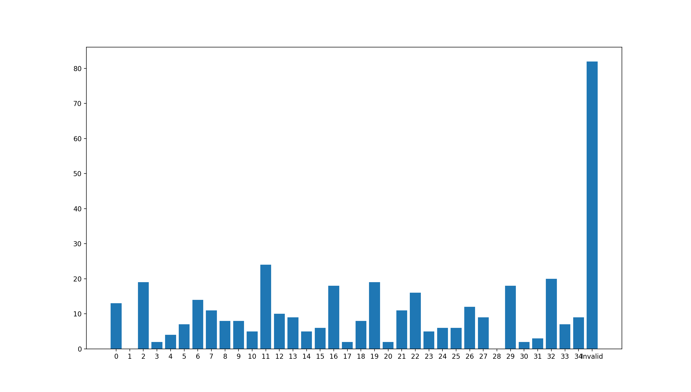

# Prove-MLE-Challenge
 
This project was built for the Prove MLE coding challenge. The program is ran on a CLI when used to predict a user from keystroke input data. The CLI uses a command line input to work and was designed to download a test set from a URL, like the sample test set provided. The algorithm for unpacking the data is also designed with the assumption that the input test set will keep the same format as the sample test given. The model is a neural network that is trained from downloaded JSON data of valid multiple users. It also outputs a list of users that qualified to be used as training data and a list of users who aren't (valid and invalid users). Once downloaded, the data is manipulated into a NumPy array. The labels are one-hot encoded. Then, the network is trained. The accuracy of this specific model is ~57% when used on testing data derived from the training set. The general idea of this model was inspired by a previous Multiclass Classification project.

## Performance Report

The model is a neural network that takes as input an array of keystroke input time. It then outputs a prediction of the user that made the input keystrokes from 35 valid users. The performance of the model is ~57% acccuracy of a testing set derived from the training set. However, it is always able to detect invalid inputs. Seen below is a graph of distribution of the model's prediction over the given test set.

As can be seen, the model predicts that most input from the test set is an invalid input, where the combination of the keystrokes and backspaces don't equate to the sentence "**Be Authentic. Be Yourself. Be Typing.**"

## Additional Questions

* If you had one additional day, what would you change or improve to your submission?
* How would you modify your solution if the number of users was 1,000 times larger?
* What insights and takeaways do you have on the distribution of user performance?
* What aspect(s) would you change about this challenge?
* What aspect(s) did you enjoy about this challenge?
